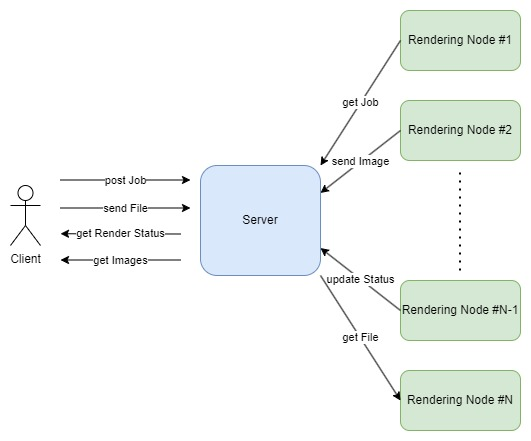

# Blenderer (distributer rendering for Blender - and others)

Blenderer is a client-server architectured software that enables to distribute rendering across multiple rendering nodes. Basically, a server handles the scheduling and the creation of rendering tasks across an API and the clients reaches to the server to get jobs. The communication is secured through SSL and API keys verifications.

# Summary

1. [How it Works](#1-how-it-works)
2. [Rendering Nodes Documentation](#2-rendering-nodes-documentation)
3. [Server Documentation](#3-server-documentation)
    1. [API Documentation](#a-api-documentation)
    2. [File Server Documentation](#b-file-server-documentation)

# 1. How it works

Basically, the application is composed of a server and one or multiple rendering nodes. All the collaborative works is done by the server through an API and a file server as shown in the diagram below :

When a client wants to render something, he can use the server API to create a rendering Task. He then uploads the files needed for render through the file server. The server will then wait for rendering nodes to asks for tasks. When a rendering node is free, it will ask the server for a task. If a task is available, the client will receive the informations associated with that task. It will then retrieve the associated files through the file server and start rendering. Once the rendering is done, it will upload the frame rendered and ask for another.

At any time, the client can call the server API to get the status of its task and retrieve the frames associated with its render through the file server.

# 2. Rendering Nodes Documentation

# 3. Server Documentation

## a) API Documentation

## b) File Server Documentation

